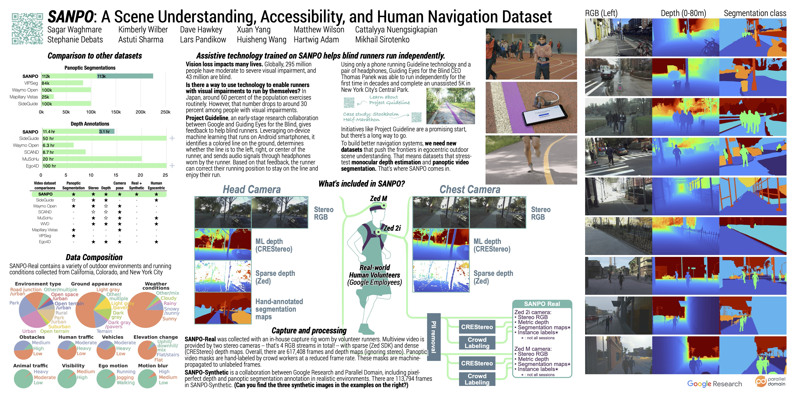

# SANPO: A (S)cene Understanding, (A)ccessibility, (N)avigation, (P)athfinding, (O)bstacle Avoidance Dataset

<div align="center">

<p align="center">

</p>

<p align="center">
<a href="#dataset"><b>Dataset</b></a> •
<a href="https://openaccess.thecvf.com/content/WACV2025/html/Waghmare_SANPO_A_Scene_Understanding_Accessibility_and_Human_Navigation_Dataset_WACV_2025_paper.html"><b>Paper</b></a> •
<a href="#download-data"><b>Download Data</b></a> •
<a href="#license--contact"><b>License & Contact</b></a>
</p>

</div>

## Updates

**06/05/2025**: We identified that orientation of SANPO-Real camera poses was
not in sync with SANPO-Synthetic (right-handed, Y-up). We have rectified the
issue and you can find the corrected camera poses for SANPO-Real in
`fixed_camera_poses.csv`.

**02/28/2025**:

- [SANPO Paper](https://openaccess.thecvf.com/content/WACV2025/html/Waghmare_SANPO_A_Scene_Understanding_Accessibility_and_Human_Navigation_Dataset_WACV_2025_paper.html) was accepted and published in [WACV 2025](https://wacv2025.thecvf.com/).
- [SANPO WACV Presentation Poster](res/sanpo-wacv25-poster.pdf):
<div align="center">
<p align="center">
<a href="res/sanpo-wacv25-poster.pdf">

</a>
</p>
</div>

## Dataset
**S**cene Understanding, **A**ccessibility, **N**avigation, **P**athfinding,
**O**bstacle Avoidance is a multi-attribute dataset of common outdoor scenes
from urban, park, and suburban settings. At its core, SANPO is a video-first
dataset. It has both real (SANPO-Real) and synthetic (SANPO-Synthetic)
counterparts. The real data is collected via an extensive data collection
effort. The synthetic data is curated in collaboration with our external
partner, [Parallel Domain](https://paralleldomain.com/).

### Dataset Contents
SANPO has...
* **Human Egocentric viewpoint**: All data is captured from an eye-level and chest-level perspective with real-world volunteer runners.
* **Stereo video**: Each camera optionally includes both left and right lenses, which may be downloaded separately
* **Real as well as synthetic data**: [Parallel Domain](https://paralleldomain.com) provides 113,000 frames of synthetic data very similar to the real-world capture conditions.
* **Sparse and dense depth maps**. Dense depth from an ML disparity estimation method (CREstereo) and sparse depth from the ZED API.
* **Camera poses**
* **Temporally consistent segmentation annotations** from crowd annotators for a subset of frames
* **High level attributes** like environment type, visibility, motion etc.

Each **session** is a separate recording of data.  A **SANPO-Real session** contains:
- High level session attributes like environment type, visibility etc.
- Two stereo videos
- Cameras' hardware information
- IMU data
- Two depth maps (meters). One from Zed cameras and another using one using the CREStereo algorithm (wrt to left side)
- Optional temporally consistent panoptic segmentation annotation (wrt left side)

A **SANPO-Synthetic session** contains:

- One video
- Camera's hardware information used in the simulation
- IMU data
- Depth map (in meters)
- Temporally consistent panoptic segmentation annotation

All the video data is in PNG format.
Segmentation masks are saved as PNG files as well.
Depth maps are in numpy arrays (saved as npz files).
All other relevant data
(including segmentation taxonomy, IMU, session attributes)
is either in csv or json files.

### Train/Test Splits
We provide lists of mutually exclusive session IDs for training and testing
for both the real and synthetic counterparts of our dataset. This is provided
in a folder named `splits` within the `sanpo-real` and `sanpo-synthetic`
folders.

### Privacy
All data collection is done in compliance with local, state, and city laws.
Every volunteer was able to review each video in the data collection app before
uploading it. All videos are processed to blur personally identifiable
information (PII) such as faces and license plates. If any sample is found to be
inadequately processed, please contact us immediately at <a href="mailto:sanpo_dataset@google.com">sanpo_dataset@google.com</a>.

## Paper
[SANPO was published in WACV 2025](https://openaccess.thecvf.com/content/WACV2025/html/Waghmare_SANPO_A_Scene_Understanding_Accessibility_and_Human_Navigation_Dataset_WACV_2025_paper.html).

## Download Data
All SANPO data can be downloaded directly from our [Google Cloud Storage bucket](https://console.cloud.google.com/storage/browser/gresearch/sanpo_dataset/v0).
You can also browse through the dataset and download specific files using the `gcloud storage cp` command:
```
gcloud storage cp -r "gs://gresearch/sanpo_dataset/v0/{FILE_OR_DIR_PATH}" .
```
See [here](https://docs.cloud.google.com/sdk/docs/install-sdk) for instructions on installing the `gcloud` tool.

### Selective download
All of the data is fairly large (~6TB). It may be desirable to download
only the portions you need. Comment out the relevant excludes from the
script below:

```bash
#!/usr/bin/env bash
SRC=gs://gresearch/sanpo_dataset/v0

EXCLUDES=""

# Exclude frames from the right lens (stereo)
EXCLUDES=$EXCLUDES'|.*/right'
# Exclude segmentation maps
EXCLUDES=$EXCLUDES'|.*/segmentation_masks'
# Exclude SANPO-synthetic depth maps and CREStereo depth maps
EXCLUDES=$EXCLUDES'|.*/depth_maps'
# Exclude depth maps from the ZED API (sparse depth)
EXCLUDES=$EXCLUDES'|.*/zed_depth_maps'

# Exclude SANPO-Real
EXCLUDES=$EXCLUDES'|sanpo-real'
# Exclude SANPO-Synthetic
EXCLUDES=$EXCLUDES'|sanpo-synthetic'

echo Running: gcloud storage rsync $SRC . --recursive --exclude="${EXCLUDES#|}"
gcloud storage rsync $SRC . --recursive --exclude="${EXCLUDES#|}"
```

## License & Contact
We release SANPO dataset under the <a href="https://creativecommons.org/licenses/by/4.0/">Creative Commons V4.0</a> license. You are free to share and adapt this data for any purpose.

If you found this dataset useful, please consider citing our paper:

<pre>
@InProceedings{Waghmare_2025_WACV,
    author    = {Waghmare, Sagar M. and Wilber, Kimberly and Hawkey, Dave and Yang, Xuan and Wilson, Matthew and Debats, Stephanie and Nuengsigkapian, Cattalyya and Sharma, Astuti and Pandikow, Lars and Wang, Huisheng and Adam, Hartwig and Sirotenko, Mikhail},
    title     = {SANPO: A Scene Understanding Accessibility and Human Navigation Dataset},
    booktitle = {Proceedings of the Winter Conference on Applications of Computer Vision (WACV)},
    month     = {February},
    year      = {2025},
    pages     = {7855-7864}
}
</pre>

If you have any questions about the dataset or paper, please send us an email at <a href="mailto:sanpo_dataset@google.com">sanpo_dataset@google.com</a>.
