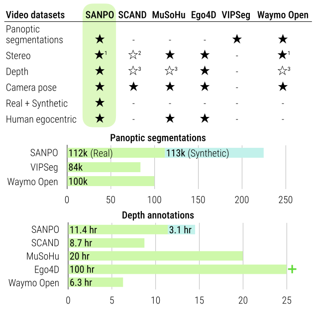

# SANPO: A (S)cene Understanding, (A)ccessibility, (N)avigation, (P)athfinding, (O)bstacle Avoidance Dataset

<video width='100%' autoplay muted loop playsinline>
<source src="res/sanpo-point-cloud.webm" type="video/webm">
<source src="res/sanpo.gif" type="image/gif">
</video>

<a href="#dataset"><b>Dataset</b></a> •
<a href="https://arxiv.org/abs/2309.12172"><b>Paper</b></a> •
<a href="#download-data"><b>Download Data</b></a> •
<a href="#license--contact"><b>License & Contact</b></a>

## Dataset
**S**cene Understanding, **A**ccessibility, **N**avigation, **P**athfinding,
**O**bstacle Avoidance is a multi-attribute dataset of common outdoor scenes
from urban, park, and suburban settings. At its core, SANPO is a video-first
dataset. It has both real (SANPO-Real) and synthetic (SANPO-Synthetic)
counterparts. The real data is collected via an extensive data collection
effort. The synthetic data is curated in collaboration with our external
partner, [Parallel Domain](https://paralleldomain.com/).

<video width='100%' autoplay muted loop playsinline>
<source src="res/sanpo.webm" type="video/webm">
</video>

### Dataset Contents
SANPO has...
* **Human Egocentric viewpoint**: All data is captured from an eye-level and chest-level perspective with real-world volunteer runners.
* **Stereo video**: Each camera optionally includes both left and right lenses, which may be downloaded separately
* **Real as well as synthetic data**: [Parallel Domain](https://paralleldomain.com) provides 113,000 frames of synthetic data very similar to the real-world capture conditions.
* **Sparse and dense depth maps**. Dense depth from an ML disparity estimation method (CREstereo) and sparse depth from the ZED API.
* **Camera pose**
* **Temporally consistent segmentation annotations** from crowd annotators for a subset of frames
* **High level attributes** like environment type, visibility, motion etc.

Each **session** is a separate recording of data.  A **SANPO-Real session** contains:
- High level session attributes like environment type, visibility etc.
- Two stereo videos
- Cameras' hardware information
- IMU data
- Two depth maps (meters). One from Zed cameras and another using one using the CREStereo algorithm (wrt to left side)
- Optional temporally consistent panoptic segmentation annotation (wrt left side)

A **SANPO-Synthetic session** contains:
- One video
- Camera's hardware information used in the simulation
- IMU data
- Depth map (in meters)
- Temporally consistent panoptic segmentation annotation

All the video data is in PNG format.
Segmentation masks are saved as PNG files as well.
Depth maps are in numpy arrays (saved as npz files).

All other relevant data
(including segmentation taxonomy, IMU, session attributes)
is either in csv or json files.

### Privacy
All data collection is done in compliance with local, state, and city laws.
Every volunteer was able to review each video in the data collection app before
uploading it. All videos are processed to blur personally identifiable
information (PII) such as faces and license plates. If any sample is found to be
inadequately processed, please contact us immediately at <a href="mailto:sanpo_dataset@google.com">sanpo_dataset@google.com</a>.

## Paper
SANPO is described in [http://arxiv.org/TODO](our publication (PDF)).

## Download Data
See our <a href="https://github.com/google-research-datasets/sanpo_dataset">github repository</a> for instructions on downloading data.

## License & Contact
We release SANPO dataset under the <a href="https://creativecommons.org/licenses/by/4.0/">Creative Commons V4.0</a> license. You are free to share and adapt this data for any purpose.

If you found this dataset useful, please consider citing our paper:

<pre>
@article{sanpo_dataset,
  title={&#123;SANPO&#125;: A Scene Understanding, Accessibility, Navigation, Pathfinding, Obstacle Avoidance Dataset},
  author={Sagar M. Waghmare and Kimberly Wilber and Dave Hawkey and Mikhail Sirotenko and Xuan Yang and Matthew Wilson and Stephanie Debats  and Cattalyya Nuengsigkapian and Astuti Sharma and Lars Pandikow and Huisheng Wang and Hartwig Adam},
  journal={arXiv preprint arXiv:2309.12172},
  year={2024}
}
</pre>

If you have any questions about the dataset or paper, please send us an email at <a href="mailto:sanpo_dataset@google.com">sanpo_dataset@google.com</a>.
